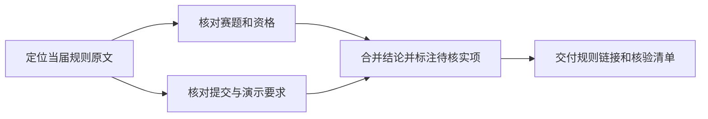

# T-10 核对赛题与参赛规则

## 任务说明

确认赛题范围、资格和提交约束，给方向选择和共享验证提供可引用的规则依据。

## 跨任务前置

无直接前置任务。

## 执行步骤

```mermaid
flowchart LR
  s1["定位当届规则原文"]
  s2["核对赛题和资格"]
  s3["核对提交与演示要求"]
  s4["合并结论并标注待核实项"]
  s5["交付规则链接和核验清单"]
  s1 --> s2
  s1 --> s3
  s2 --> s4
  s3 --> s4
  s4 --> s5
```

[在浏览器查看步骤图](index.html#steps)

## 交付标准

每条关键结论能回到规则原文，并标出仍待官方确认的条款。
