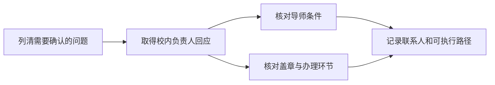

# T-11 确认导师与校内盖章办理路径

## 任务说明

向校内负责人核实导师资格、盖章要求和实际办理路径。当前样例缺少校内负责人的确认。

## 跨任务前置

无直接前置任务。

## 执行步骤

```mermaid
flowchart LR
  s1["列清需要确认的问题"]
  s2["取得校内负责人回应"]
  s3["核对导师条件"]
  s4["核对盖章与办理环节"]
  s5["记录联系人和可执行路径"]
  s1 --> s2
  s2 --> s3
  s2 --> s4
  s3 --> s5
  s4 --> s5
```

[在浏览器查看步骤图](index.html#steps)

## 交付标准

负责人和适用条件均有依据。等待回应期间可以记录已做的询问；收到有效确认后再解除阻塞。
