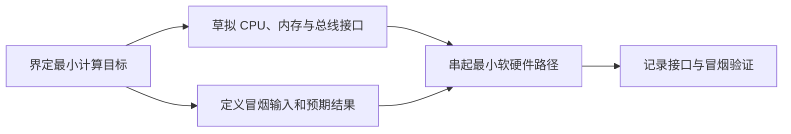

# T-13 定义 SoC 最小计算闭环

## 任务说明

为后续复用判断建立可运行的最小计算闭环及接口边界。

## 跨任务前置

无直接前置任务。

## 执行步骤

```mermaid
flowchart LR
  s1["界定最小计算目标"]
  s2["草拟 CPU、内存与总线接口"]
  s3["定义冒烟输入和预期结果"]
  s4["串起最小软硬件路径"]
  s5["记录接口与冒烟验证"]
  s1 --> s2
  s1 --> s3
  s2 --> s4
  s3 --> s4
  s4 --> s5
```

[在浏览器查看步骤图](index.html#steps)

## 交付标准

有可核对的接口说明、冒烟步骤与观测结果。
