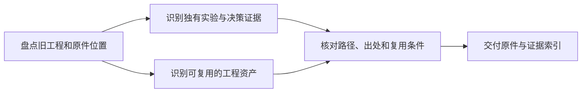

# T-16 整理旧工程的独有证据与可复用资产

## 任务说明

建立能回到原件的索引，供后续复盘和资产复用。

## 跨任务前置

无直接前置任务。

## 执行步骤

```mermaid
flowchart LR
  s1["盘点旧工程和原件位置"]
  s2["识别独有实验与决策证据"]
  s3["识别可复用的工程资产"]
  s4["核对路径、出处和复用条件"]
  s5["交付原件与证据索引"]
  s1 --> s2
  s1 --> s3
  s2 --> s4
  s3 --> s4
  s4 --> s5
```

[在浏览器查看步骤图](index.html#steps)

## 交付标准

索引项可以打开原件，有用途、来源和适用边界。此步骤只要求整理引用。
